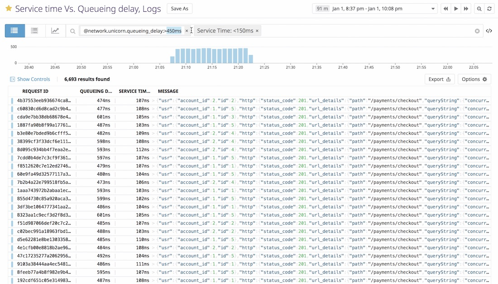
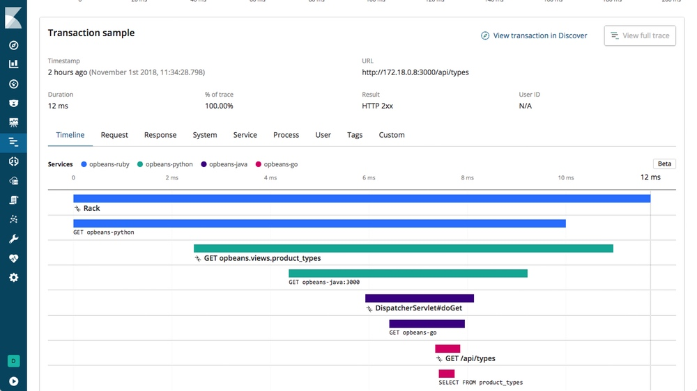

# Observability: Metric, Logging, and Tracing

Un sistema distribuido es uno en el cual el fallo de una computadora que ni siquera sabía que existía puede hacer que mi propia computador quede inutilizable - Leslie Camport

Monitoring me permite responder solo las preguntas que yo ya tenía preparadas.

## Observability

En la teoría de control, observability es una medida de que tan bien los estados internos de un sistema pueden ser inferidos por conocimiento de sus outputs externos. Observability y controllability de un sistema son matematicamente duales.

En otras palabras, es posible entender lo que pasa en el interior de mi código y de mis sistemas simplemente haciendo preguntas usando mis herramientas? Puedo responder cualquier pregunta nueva que se me ocurra, o solamente las que yo haya preparado?

### Pilares de observability

- Metrics
- Logging
- Tracing

## Logging

Un log es inmutable, un registro de una marca de tiempo de eventos discretos que ocurrieron durante el tiempo.

> Lista de logs desplegados en Datadog

### Ejemplo

Un itinerario de vuelo es un buen ejemplo de este principio: Todos registramos a los pasajeros y los miembros del equipo antes de que salga el vuelo, asi sabemos quienes están en el avión en un tiempo especifico.

## Tracing

Un rastro es una representación de una serie de eventos distribuidos casualmente relacionados que codifican el flujo de solicitudes de extremo a extremo a través de un sistema distribuido.

> Un rastro distribuido usando ELK stack

## Metrics

Las metrics son representaciones numéricas de información medida en intervalos de tiempo.

### ¿Qué métricas?

Google recomienda las **Four Golden Signals**

- latency: Tiempo para atender a una solicitud.
- traffic: solicitudes/segundo
- error: Tasa de error de las solicitudes
- saturation: Plenitud de un servicio.
